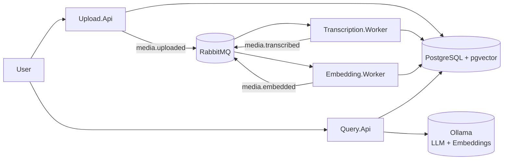
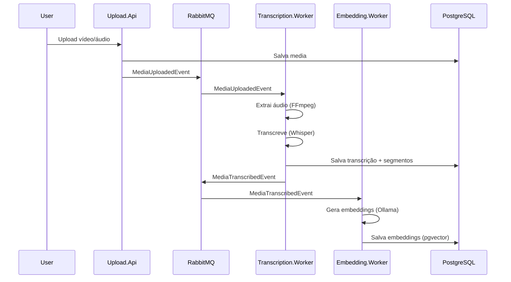
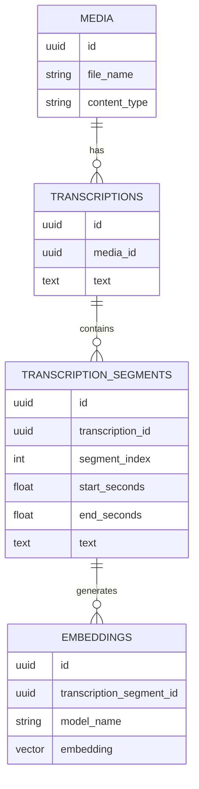

# Media Search Engine with RAG (.NET + Whisper + pgvector)

## 📌 Descrição do Projeto

Este projeto consiste em uma plataforma backend robusta desenvolvida em .NET para ingestão, processamento e consulta semântica de arquivos de mídia (áudio e vídeo). O sistema busca simplificar a consulta de conteúdo de vídeos e áudios, permitindo que usuários façam perguntas em linguagem natural e obtenham respostas baseadas no conteúdo falado nos vídeos, com referência temporal precisa.

A solução utiliza uma abordagem 100% local (On-Premise) para Inteligência Artificial, empregando Whisper para transcrição e Ollama para geração de embeddings e respostas (RAG), garantindo privacidade de dados e eliminação de custos com APIs de terceiros, mas pode a arquitetura pode ser reaproveitada para a utilização de serviços de AI externos.

## 🏗 Arquitetura da Solução

O sistema foi desenhado seguindo uma **Arquitetura Orientada a Eventos (Event-Driven Architecture)**, desacoplando os processos de ingestão, processamento pesado (transcrição/embeddings) e consulta.

* **APIs e Workers:** A solução é dividida em APIs (Upload e Query) para interação síncrona com o usuário e Workers (Transcription e Embedding) para processamento assíncrono em background.
* **Mensageria:** O **RabbitMQ** atua como arcabouço de comunicação, garantindo que cada etapa do pipeline seja acionada por eventos de domínio (`MediaUploadedEvent`, `MediaTranscribedEvent`), proporcionando escalabilidade e resiliência.
* **Persistência:** O **PostgreSQL** é utilizado como banco de dados central, utilizando a extensão **pgvector** para armazenamento e consulta eficiente de vetores de alta dimensão.

## 🔄 Fluxo de Funcionamento

O pipeline de processamento segue as seguintes etapas:

1. **Upload:** O usuário envia um arquivo de mídia (áudio/vídeo) para a `Upload.Api`, selecionando opcionalmente o modelo de transcrição (ex: Medium, Large). O arquivo é armazenado e um evento `MediaUploadedEvent` é publicado.
2. **Transcrição:** O `Transcription.Worker` consome o evento, extrai o áudio e utiliza o **Whisper.NET** (com modelos GGML locais) para transcrever o conteúdo. O texto é segmentado por tempo e persistido, gerando um evento `MediaTranscribedEvent`.
3. **Embeddings:** O `Embedding.Worker` reage ao evento de transcrição, processa cada segmento de texto utilizando o **Ollama** para gerar vetores numéricos (embeddings) que representam o significado semântico do trecho.
4. **Indexação:** Os vetores gerados são armazenados na tabela `embeddings` do PostgreSQL, prontos para busca vetorial.
5. **Consulta (RAG):** Na `Query.Api`, a pergunta do usuário é convertida em vetor. O sistema realiza uma busca por similaridade no banco, recupera os segmentos mais relevantes e utiliza um LLM (via Ollama) para gerar uma resposta contextualizada.

## 🚀 Tecnologias Utilizadas

* **Linguagem Principal**: [C# .NET 8](https://dotnet.microsoft.com/)
* **APIs & Workers**: ASP.NET Core Web API, Background Services
* **Mensageria**: [RabbitMQ](https://www.rabbitmq.com/) (Event-Driven Architecture)
* **Banco de Dados**: [PostgreSQL](https://www.postgresql.org/)
* **Busca Vetorial**: [pgvector](https://github.com/pgvector/pgvector)
* **ORM / Data Access**: Entity Framework Core & [Dapper](https://github.com/DapperLib/Dapper)
* **Biblioteca de IA & LLM**: [Microsoft.Extensions.AI](https://devblogs.microsoft.com/dotnet/introducing-microsoft-extensions-ai-preview/)
* **Modelos Locais**: [Ollama](https://ollama.com/) (phi3:mini, bge-M3)
* **Transcrição**: [Whisper.net](https://github.com/sandrohanea/whisper.net)
* **Processamento de Mídia**: [FFmpeg](https://ffmpeg.org/)
* **Infraestrutura**: Docker & Docker Compose

## Modelo de Dados (Visão Geral)

O banco de dados foi modelado para suportar o fluxo de RAG com rastreabilidade:

* **media:** Armazena metadados dos arquivos originais (caminho, tamanho, tipo, data de upload).
* **transcriptions:** Contém o registro da transcrição completa, incluindo métricas como modelo utilizado e tempo de processamento.
* **transcription_segments:** Tabela central para o RAG. Armazena o texto quebrado em pequenos trechos com seus respectivos timestamps (início e fim).
* **embeddings:** Tabela vetorial que vincula cada segmento ao seu vetor representativo (embedding), permitindo a busca semântica.

## 🧠 Busca Semântica e RAG

A funcionalidade de busca (Retrieval-Augmented Generation) é o coração do sistema:

1. **Vetorização:** A pergunta do usuário é transformada em um vetor de embeddings usando o mesmo modelo da ingestão.
2. **Busca Vetorial:** O PostgreSQL utiliza o operador `<=>` (distância de cosseno/euclidiana) para encontrar os segmentos de transcrição semanticamente mais próximos da pergunta.
3. **Contexto:** Os trechos recuperados são montados em um prompt de sistema ("Contexto").
4. **Geração:** O LLM recebe a pergunta e o contexto, gerando uma resposta natural baseada estritamente nas informações encontradas na mídia.

## 🏗️ Arquitetura

O sistema segue uma arquitetura distribuída onde cada etapa do pipeline é desacoplada e reage a eventos de domínio. Isso permite escalabilidade independente (ex: aumentar workers de transcrição sem afetar a API de upload) e resiliência.

### Fluxo de Dados

#### Diagrama de Arquitetura Geral (Microserviços)



#### Pipeline da arquitetura orientada a eventos (Event-Driven)



#### Modelo de Dados (Visão Conceitual)



## 🛠 Como Executar o Projeto

### Pré-requisitos

* Docker e Docker Compose instalados.
* .NET 10 SDK (para desenvolvimento/build local).
* Ollama rodando localmente (ou configurável via Docker) com os modelos necessários (ex: `llama3`, `nomic-embed-text`).

### Passo a Passo

1. **Clone o repositório**

    ```bash
    git clone https://github.com/seu-usuario/MediaTranscriptKnowledgeRAG.git
    cd MediaTranscriptKnowledgeRAG
    ```

2. **Suba a infraestrutura (RabbitMQ + Postgres)**

    ```bash
    docker-compose up -d
    ```

3. **Execute as aplicações**
    Você pode rodar via Docker ou diretamente pelo .NET CLI:

    ```bash
    # Exemplo rodando a API de Upload
    dotnet run --project src/services/Upload.Api
    ```

4. **Acesse o Swagger**
    * Upload API: `https://localhost:7290/swagger`
    * Query API: `https://localhost:7032/swagger`

---

> **Nota:** Na primeira execução, o `Transcription.Worker` pode levar alguns instantes para baixar o modelo Whisper selecionado (se ainda não estiver em cache).

## 📈 Status e Evolução

### ✅ Funcionalidades Atuais

* [x] Upload e armazenamento de arquivos.
* [x] Transcrição offline com Whisper.
* [x] Segmentação temporal precisa.
* [x] Geração de Embeddings assíncrona.
* [x] Busca Semântica (RAG) funcional.
* [x] Comunicação com RabbitMQ
* [x] Arquitetura orientada a eventos  

### 🚀 Próximos Passos (Roadmap)

* [ ] Interface de Usuário (Web App).
* [ ] Suporte a múltiplos modelos de LLM via configuração.
* [ ] Autenticação e Multi-tenancy.
* [ ] Pipeline de reprocessamento de embeddings.
