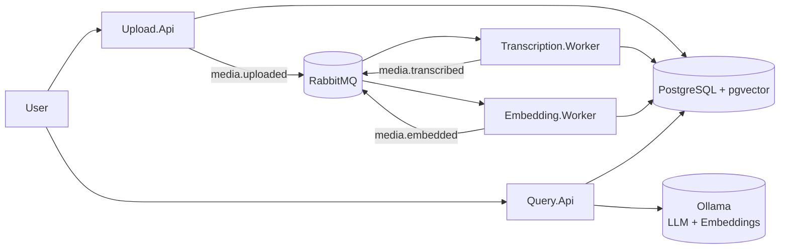
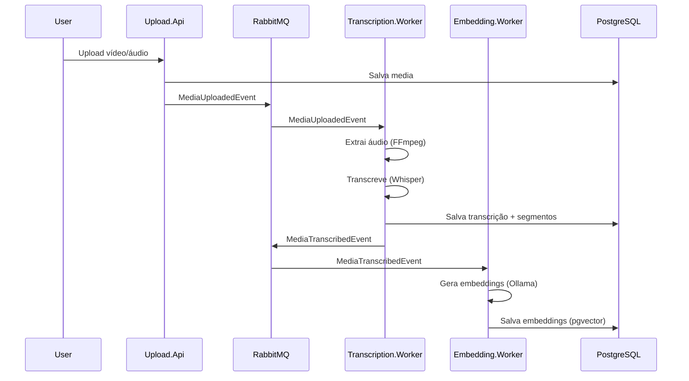
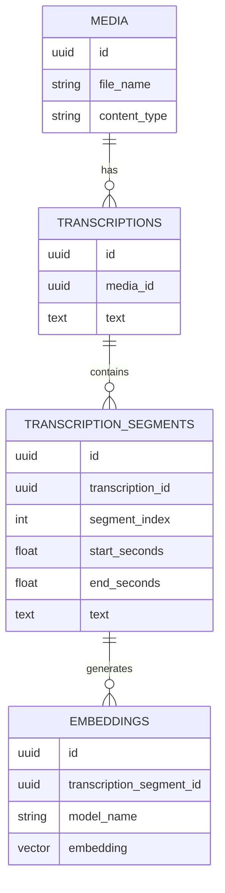

# 🧠 Media Transcript Knowledge RAG

Uma plataforma de backend baseada em **microserviços** e **arquitetura orientada a eventos** para ingestão, transcrição e consulta semântica (RAG) de mídias (áudio/vídeo).

O sistema utiliza **IA local** (Ollama e Whisper) para garantir privacidade e reduzir custos, orquestrando todo o fluxo de processamento de forma assíncrona via RabbitMQ.

---

## 🚀 Tecnologias

* **Runtime**: [.NET 8](https://dotnet.microsoft.com/)
* **APIs & Workers**: ASP.NET Core Web API, Background Services
* **Mensageria**: [RabbitMQ](https://www.rabbitmq.com/) (Event-Driven Architecture)
* **Banco de Dados**: [PostgreSQL](https://www.postgresql.org/)
* **Busca Vetorial**: [pgvector](https://github.com/pgvector/pgvector)
* **ORM / Data Access**: Entity Framework Core & [Dapper](https://github.com/DapperLib/Dapper)
* **IA & LLM**: [Microsoft.Extensions.AI](https://devblogs.microsoft.com/dotnet/introducing-microsoft-extensions-ai-preview/)
* **Modelos Locais**: [Ollama](https://ollama.com/) (Llama 3, Nomic Embed)
* **Transcrição**: [Whisper.net](https://github.com/sandrohanea/whisper.net)
* **Processamento de Mídia**: [FFmpeg](https://ffmpeg.org/)
* **Infraestrutura**: Docker & Docker Compose

---

## 🏗️ Arquitetura

O sistema segue uma arquitetura distribuída onde cada etapa do pipeline é desacoplada e reage a eventos de domínio. Isso permite escalabilidade independente (ex: aumentar workers de transcrição sem afetar a API de upload) e resiliência.

### Fluxo de Dados

#### Diagrama de Arquitetura Geral (Microserviços)



#### Pipeline da arquitetura orientada a eventos (Event-Driven)



#### Modelo de Dados (Visão Conceitual)



---

## 📦 Microserviços

### 📤 Upload.Api

Ponto de entrada para ingestão de arquivos.

* **Responsabilidade**: Receber arquivos de áudio/vídeo, validar formatos e persistir no disco local.
* **Banco de Dados**: Registra metadados na tabela `media`.
* **Output**: Publica o evento `MediaUploadedEvent` na fila.

### 🎙 Transcription.Worker

Processador de áudio dedicado.

* **Responsabilidade**: Consumir eventos de upload, extrair áudio de vídeos (via FFmpeg) e realizar transcrição.
* **Core**: Utiliza **Whisper local** para transcrição de alta precisão.
* **Diferencial**: Gera transcrições **segmentadas por tempo** (timestamps de início/fim), essenciais para RAG preciso.
* **Output**: Salva segmentos na tabela `transcription_segments` e publica `MediaTranscribedEvent`.

### 🧠 Embedding.Worker

Gerador de vetores semânticos.

* **Responsabilidade**: Transformar texto em representações vetoriais (embeddings).
* **Processo**: Consome eventos de transcrição e processa cada segmento individualmente.
* **IA**: Utiliza modelos de embedding locais via Ollama (ex: `nomic-embed-text`).
* **Output**: Persiste vetores na tabela `embeddings` (coluna `vector`).

### 🔍 Query.Api (RAG)

Interface de consulta inteligente.

* **Responsabilidade**: Responder perguntas do usuário com base no conteúdo das mídias.
* **Pipeline RAG**:
    1. Gera embedding da pergunta.
    2. Realiza busca por similaridade (cosine distance) no PostgreSQL via **Dapper**.
    3. Recupera os segmentos mais relevantes com seus timestamps.
    4. Monta o contexto e solicita a resposta ao LLM (Llama 3).

---

## 🗃️ Modelo de Dados

O banco de dados PostgreSQL é estruturado para suportar busca híbrida e vetorial.

* **`media`**: Metadados do arquivo (nome, caminho, duração).
* **`transcriptions`**: Cabeçalho da transcrição (modelo usado, idioma).
* **`transcription_segments`**: O coração do RAG. Contém o texto segmentado com `start_seconds` e `end_seconds`.
* **`embeddings`**: Armazena os vetores gerados para cada segmento. Utiliza a extensão `pgvector` para indexação (IVFFlat) e busca eficiente.

---

## 🔍 Consulta Semântica (RAG)

A API de consulta implementa o padrão **Retrieval-Augmented Generation**:

1. **Vetorização**: A pergunta do usuário ("O que foi dito sobre arquitetura?") é convertida em um vetor numérico pelo mesmo modelo usado na indexação.
2. **Busca Vetorial**: Uma query SQL (via Dapper) busca os segmentos mais próximos semanticamente:

    ```sql
    SELECT text, start_seconds 
    FROM embeddings 
    ORDER BY embedding <=> @queryVector 
    LIMIT 5
    ```

3. **Contextualização**: O sistema monta um prompt com os trechos encontrados:
    > *[00:10 - 00:25] A arquitetura orientada a eventos permite desacoplamento...*
4. **Geração**: O LLM recebe o prompt e gera uma resposta fundamentada apenas no contexto fornecido.

---

## ⚙️ Como Executar

### Pré-requisitos

* [Docker](https://www.docker.com/) e Docker Compose instalados.
* [Ollama](https://ollama.com/) rodando localmente (ou configurável no docker).
* Modelos Ollama baixados: `ollama pull llama3` e `ollama pull nomic-embed-text`.

### Passo a Passo

1. **Clone o repositório**

    ```bash
    git clone https://github.com/seu-usuario/MediaTranscriptKnowledgeRAG.git
    cd MediaTranscriptKnowledgeRAG
    ```

2. **Suba a infraestrutura (RabbitMQ + Postgres)**

    ```bash
    docker-compose up -d
    ```

3. **Execute as aplicações**
    Você pode rodar via Docker ou diretamente pelo .NET CLI:

    ```bash
    # Exemplo rodando a API de Upload
    dotnet run --project src/services/Upload.Api
    ```

4. **Acesse o Swagger**
    * Upload API: `http://localhost:5000/swagger`
    * Query API: `http://localhost:5200/swagger`

---

## 📈 Status e Evolução

### ✅ Funcionalidades Atuais

* [x] Upload e armazenamento de arquivos.
* [x] Transcrição offline com Whisper.
* [x] Segmentação temporal precisa.
* [x] Geração de Embeddings assíncrona.
* [x] Busca Semântica (RAG) funcional.

### 🚀 Próximos Passos (Roadmap)

* [ ] Interface de Usuário (Web App).
* [ ] Suporte a múltiplos modelos de LLM via configuração.
* [ ] Autenticação e Multi-tenancy.
* [ ] Pipeline de reprocessamento de embeddings.
