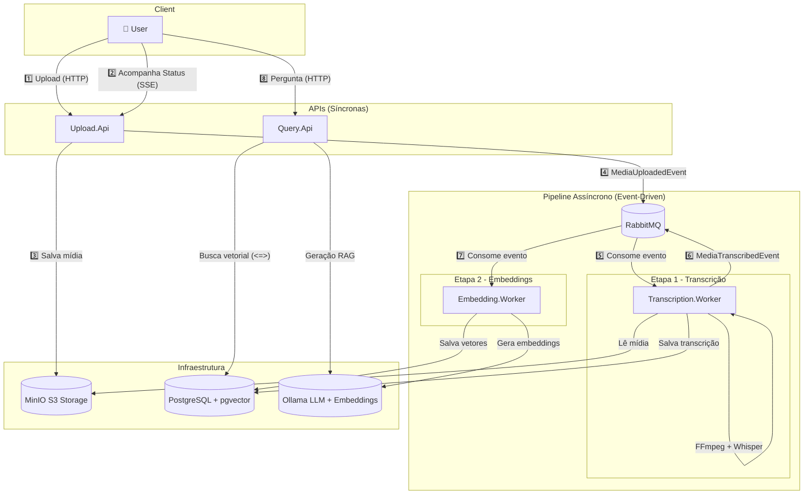
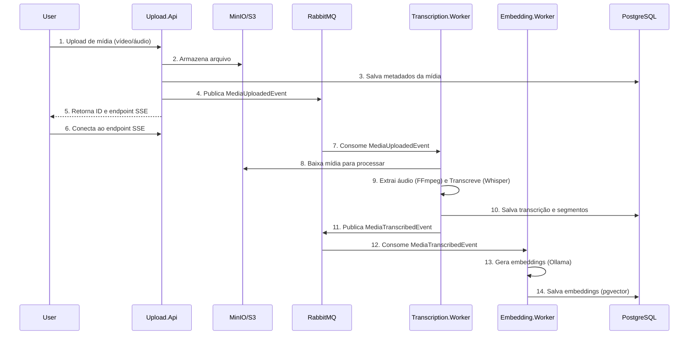
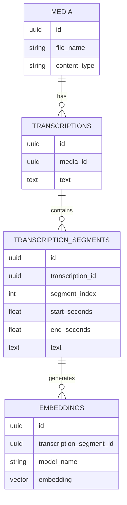

# Media Search Engine with RAG (.NET + Whisper + pgvector)

## 📌 Descrição do Projeto

Este projeto consiste em uma plataforma backend robusta desenvolvida em .NET para ingestão, processamento e consulta semântica de arquivos de mídia (áudio e vídeo). O sistema busca simplificar a consulta de conteúdo de vídeos e áudios, permitindo que usuários façam perguntas em linguagem natural e obtenham respostas baseadas no conteúdo falado nos vídeos, com referência temporal precisa.

A solução utiliza uma abordagem 100% local (On-Premise) para Inteligência Artificial, empregando Whisper para transcrição e Ollama para geração de embeddings e respostas (RAG), garantindo privacidade de dados e eliminação de custos com APIs de terceiros, mas pode a arquitetura pode ser reaproveitada para a utilização de serviços de AI externos.

## 🏗 Arquitetura da Solução

O sistema foi desenhado seguindo uma **Arquitetura Orientada a Eventos (Event-Driven Architecture)**, desacoplando os processos de ingestão, processamento pesado (transcrição/embeddings) e consulta.

* **APIs e Workers:** A solução é dividida em APIs (Upload e Query) para interação síncrona com o usuário e Workers (Transcription e Embedding) para processamento assíncrono em background.
* **Mensageria:** O **RabbitMQ** atua como arcabouço de comunicação, garantindo que cada etapa do pipeline seja acionada por eventos de domínio (`MediaUploadedEvent`, `MediaTranscribedEvent`), proporcionando escalabilidade e resiliência.
* **Persistência:** O **PostgreSQL** é utilizado como banco de dados central, utilizando a extensão **pgvector** para armazenamento e consulta eficiente de vetores de alta dimensão.

## 🔄 Fluxo de Funcionamento

O pipeline de processamento segue as seguintes etapas:

1. **Upload:** O usuário envia um arquivo de mídia (áudio/vídeo) para a `Upload.Api`, selecionando opcionalmente o modelo de transcrição (ex: Medium, Large). O arquivo é armazenado e um evento `MediaUploadedEvent` é publicado.
2. **Transcrição:** O `Transcription.Worker` consome o evento, extrai o áudio e utiliza o **Whisper.NET** (com modelos GGML locais) para transcrever o conteúdo. O texto é segmentado por tempo e persistido, gerando um evento `MediaTranscribedEvent`.
3. **Embeddings:** O `Embedding.Worker` reage ao evento de transcrição, processa cada segmento de texto utilizando o **Ollama** para gerar vetores numéricos (embeddings) que representam o significado semântico do trecho.
4. **Indexação:** Os vetores gerados são armazenados na tabela `embeddings` do PostgreSQL, prontos para busca vetorial.
5. **Consulta (RAG):** Na `Query.Api`, a pergunta do usuário é convertida em vetor. O sistema realiza uma busca por similaridade no banco, recupera os segmentos mais relevantes e utiliza um LLM (via Ollama) para gerar uma resposta contextualizada.

## 🚀 Tecnologias Utilizadas

* **Linguagem Principal**: [C# .NET 8](https://dotnet.microsoft.com/)
* **APIs & Workers**: ASP.NET Core Web API, Background Services
* **Mensageria**: [RabbitMQ](https://www.rabbitmq.com/) (Event-Driven Architecture)
* **Banco de Dados**: [PostgreSQL](https://www.postgresql.org/)
* **Busca Vetorial**: [pgvector](https://github.com/pgvector/pgvector)
* **Armazenamento de Mídia**: [MinIO](https://min.io/) (S3-compatible para ambiente local)
* **ORM / Data Access**: Entity Framework Core & [Dapper](https://github.com/DapperLib/Dapper)
* **Biblioteca de IA & LLM**: [Microsoft.Extensions.AI](https://devblogs.microsoft.com/dotnet/introducing-microsoft-extensions-ai-preview/)
* **Modelos Locais**: [Ollama](https://ollama.com/) (phi3:mini, bge-M3)
* **Transcrição**: [Whisper.net](https://github.com/sandrohanea/whisper.net)
* **Processamento de Mídia**: [FFmpeg](https://ffmpeg.org/) (Containerizado)
* **Infraestrutura**: Docker & Docker Compose

## Modelo de Dados (Visão Geral)

O banco de dados foi modelado para suportar o fluxo de RAG com rastreabilidade:

* **media:** Armazena metadados dos arquivos originais (caminho, tamanho, tipo, data de upload).
* **transcriptions:** Contém o registro da transcrição completa, incluindo métricas como modelo utilizado e tempo de processamento.
* **transcription_segments:** Tabela central para o RAG. Armazena o texto quebrado em pequenos trechos com seus respectivos timestamps (início e fim).
* **embeddings:** Tabela vetorial que vincula cada segmento ao seu vetor representativo (embedding), permitindo a busca semântica.

## 🧠 Busca Semântica e RAG

A funcionalidade de busca (Retrieval-Augmented Generation) é o coração do sistema:

1. **Vetorização:** A pergunta do usuário é transformada em um vetor de embeddings usando o mesmo modelo da ingestão.
2. **Busca Vetorial:** O PostgreSQL utiliza o operador `<=>` (distância de cosseno/euclidiana) para encontrar os segmentos de transcrição semanticamente mais próximos da pergunta.
3. **Contexto:** Os trechos recuperados são montados em um prompt de sistema ("Contexto").
4. **Geração:** O LLM recebe a pergunta e o contexto, gerando uma resposta natural baseada estritamente nas informações encontradas na mídia.

## 🏗️ Arquitetura

O sistema segue uma arquitetura distribuída onde cada etapa do pipeline é desacoplada e reage a eventos de domínio. Isso permite escalabilidade independente (ex: aumentar workers de transcrição sem afetar a API de upload) e resiliência.

### Infraestrutura Local (Docker Compose)

Para simular um ambiente de produção robusto e isolado, toda a infraestrutura de backend é gerenciada via Docker Compose. Isso inclui:

* **RabbitMQ:** Broker de mensageria para a comunicação assíncrona.
* **PostgreSQL + pgvector:** Banco de dados para persistência de metadados e vetores.
* **MinIO:** Serviço de armazenamento de objetos compatível com a API S3.

#### Armazenamento de S3 simulado com MinIO

Foi utilizado o **MinIO** para ser o armazenamento de arquivos de vídeos/áudios, substituindo o storage diretamente no disco local. Essa abordagem traz vantagens significativas para o ambiente de desenvolvimento e testes:

* **Simulação de Ambiente Cloud:** Emula o comportamento de serviços como o AWS S3, preparando a aplicação para uma migração transparente para a nuvem.
* **Isolamento:** Os arquivos de mídia são armazenados em um *bucket* dedicado (`media-files`), evitando a dispersão de arquivos no sistema de arquivos do host.
* **Integração:** A `Upload.Api` é configurada para se conectar ao endpoint do MinIO, fazendo o upload dos arquivos de forma segura. O `Transcription.Worker` também acessa os arquivos a partir do MinIO para processamento.
* **Portabilidade:** O estado da aplicação (banco de dados e arquivos) fica contido nos volumes do Docker, facilitando a replicação do ambiente em diferentes máquinas.

> **Nota:** O MinIO é utilizado estritamente para o ambiente local. Em produção, as configurações podem ser facilmente ajustadas para apontar para um serviço S3 gerenciado (AWS, Google Cloud Storage, etc.).

### Fluxo de Dados

#### Diagrama de Arquitetura Geral (Componentes)


```mermaid
flowchart TB

    %% =========================
    %% CLIENT
    %% =========================
    subgraph CLIENT["Client"]
        User["👤 User"]
    end

    %% =========================
    %% CAMADA SÍNCRONA
    %% =========================
    subgraph APIS["APIs (Síncronas)"]
        UploadApi["Upload.Api"]
        QueryApi["Query.Api"]
    end

    %% =========================
    %% PIPELINE ASSÍNCRONO
    %% =========================
    subgraph PIPELINE["Pipeline Assíncrono (Event-Driven)"]

        direction TB

        RabbitMQ[("RabbitMQ")]

        subgraph TRANSCRIPTION["Etapa 1 - Transcrição"]
            TranscriptionWorker["Transcription.Worker"]
        end

        subgraph EMBEDDING["Etapa 2 - Embeddings"]
            EmbeddingWorker["Embedding.Worker"]
        end

    end

    %% =========================
    %% INFRA
    %% =========================
    subgraph INFRA["Infraestrutura"]
        MinIO[("MinIO S3 Storage")]
        Postgres[("PostgreSQL + pgvector")]
        Ollama[("Ollama LLM + Embeddings")]
    end

    %% =========================
    %% FLUXO CLIENTE
    %% =========================
    User -->|"1️⃣ Upload (HTTP)"| UploadApi
    User -->|"2️⃣ Acompanha Status (SSE)"| UploadApi
    User -->|"8️⃣ Pergunta (HTTP)"| QueryApi

    %% =========================
    %% UPLOAD
    %% =========================
    UploadApi -->|"3️⃣ Salva mídia"| MinIO
    UploadApi -->|"4️⃣ MediaUploadedEvent"| RabbitMQ

    %% =========================
    %% TRANSCRIÇÃO
    %% =========================
    RabbitMQ -->|"5️⃣ Consome evento"| TranscriptionWorker
    TranscriptionWorker -->|"Lê mídia"| MinIO
    TranscriptionWorker -->|"FFmpeg + Whisper"| TranscriptionWorker
    TranscriptionWorker -->|"Salva transcrição"| Postgres
    TranscriptionWorker -->|"6️⃣ MediaTranscribedEvent"| RabbitMQ

    %% =========================
    %% EMBEDDINGS
    %% =========================
    RabbitMQ -->|"7️⃣ Consome evento"| EmbeddingWorker
    EmbeddingWorker -->|"Gera embeddings"| Ollama
    EmbeddingWorker -->|"Salva vetores"| Postgres

    %% =========================
    %% RAG
    %% =========================
    QueryApi -->|"Busca vetorial (<=>)"| Postgres
    QueryApi -->|"Geração RAG"| Ollama
```

#### Pipeline da arquitetura orientada a eventos (Event-Driven)


```mermaid
sequenceDiagram
    participant U as User
    participant UA as Upload.Api
    participant S3 as MinIO/S3
    participant MQ as RabbitMQ
    participant TW as Transcription.Worker
    participant EW as Embedding.Worker
    participant DB as PostgreSQL

    U ->> UA: 1. Upload de mídia (vídeo/áudio)
    UA ->> S3: 2. Armazena arquivo
    UA ->> DB: 3. Salva metadados da mídia
    UA ->> MQ: 4. Publica MediaUploadedEvent
    UA -->> U: 5. Retorna ID e endpoint SSE

    U ->> UA: 6. Conecta ao endpoint SSE

    MQ ->> TW: 7. Consome MediaUploadedEvent
    TW ->> S3: 8. Baixa mídia para processar
    TW ->> TW: 9. Extrai áudio (FFmpeg) e Transcreve (Whisper)
    TW ->> DB: 10. Salva transcrição e segmentos
    TW ->> MQ: 11. Publica MediaTranscribedEvent

    MQ ->> EW: 12. Consome MediaTranscribedEvent
    EW ->> EW: 13. Gera embeddings (Ollama)
    EW ->> DB: 14. Salva embeddings (pgvector)
```

#### Modelo de Dados (Visão Conceitual)


```mermaid
erDiagram
    MEDIA ||--o{ TRANSCRIPTIONS : has
    TRANSCRIPTIONS ||--o{ TRANSCRIPTION_SEGMENTS : contains
    TRANSCRIPTION_SEGMENTS ||--o{ EMBEDDINGS : generates

    MEDIA {
        uuid id
        string file_name
        string content_type
    }

    TRANSCRIPTIONS {
        uuid id
        uuid media_id
        text text
    }

    TRANSCRIPTION_SEGMENTS {
        uuid id
        uuid transcription_id
        int segment_index
        float start_seconds
        float end_seconds
        text text
    }

    EMBEDDINGS {
        uuid id
        uuid transcription_segment_id
        string model_name
        vector embedding
    }


```

### 🔄 Acompanhamento em Tempo Real com Server-Sent Events (SSE)

Para oferecer uma experiência de usuário mais interativa e transparente, o sistema implementa **Server-Sent Events (SSE)** para o acompanhamento em tempo real do status do processamento de mídia. Após o upload, o cliente pode se conectar a um endpoint SSE na `Upload.Api` para receber atualizações progressivas.

#### Fluxo de Status

O servidor envia eventos de status à medida que o processamento avança no pipeline assíncrono:

1. **`media-uploaded`**: Confirma que o arquivo foi recebido e o processo iniciado.
2. **`transcription-started`**: Indica que o `Transcription.Worker` começou a processar o áudio.
3. **`transcription-completed`**: A transcrição foi finalizada e os segmentos foram salvos.
4. **`embedding-started`**: O `Embedding.Worker` iniciou a geração dos vetores.
5. **`embedding-completed`**: O processo foi finalizado com sucesso e a mídia está pronta para ser consultada.

#### Por que SSE?

A escolha pelo SSE em vez de WebSockets ou polling tradicional foi estratégica:

* **Simplicidade:** SSE é um padrão web nativo, unidirecional (servidor -> cliente), que pode ser consumido facilmente no front-end com a interface `EventSource`.
* **Eficiência:** Mantém uma conexão HTTP persistente, eliminando a sobrecarga de múltiplas requisições de polling e o overhead de um handshake de WebSocket.
* **Leveza:** É ideal para enviar pequenas e infrequentes atualizações de texto, como é o caso dos status de processamento.

Essa abordagem melhora a experiência do usuário, fornecendo feedback imediato sobre um processo de longa duração.

### Containerização e Ambiente de Execução

Todas as aplicações do sistema (`Upload.Api`, `Transcription.Worker`, `Embedding.Worker`, `Query.Api`) são totalmente containerizadas, cada uma com seu próprio `Dockerfile`. Essa abordagem garante um ambiente de desenvolvimento e produção consistente e isolado.

#### FFmpeg no `Transcription.Worker`

Uma decisão arquitetural importante foi a instalação do **FFmpeg** diretamente dentro da imagem Docker do `Transcription.Worker`. Isso oferece benefícios cruciais:

* **Reprodutibilidade:** O ambiente de execução é idêntico em qualquer máquina que execute o Docker, eliminando problemas de "funciona na minha máquina".
* **Independência do Host:** O worker não depende de nenhuma biblioteca ou CLI pré-instalada no sistema operacional do host, simplificando o setup.
* **Isolamento de Dependências:** A versão do FFmpeg é controlada e testada junto com a aplicação, evitando conflitos de versão.

O build de cada serviço é feito individualmente, permitindo atualizações e deploys granulares.

## 🛠 Como Executar o Projeto

O projeto é configurado para ser executado 100% via Docker, simplificando o setup e garantindo consistência.

### Pré-requisitos

* Docker e Docker Compose instalados.
* Ollama rodando localmente com os modelos necessários (ex: `phi3:mini`, `bge-m3`).

### Passo a Passo

1. **Clone o repositório**

    ```bash
    git clone https://github.com/brendon3578/MediaTranscriptKnowledgeRAG.git
    cd MediaTranscriptKnowledgeRAG
    ```

2. **Suba todo o ambiente com Docker Compose**

    O comando a seguir irá construir as imagens de cada serviço e iniciar todos os contêineres da infraestrutura e da aplicação (APIs e Workers).

    ```bash
    docker-compose up --build
    ```

3. **Acesse o Swagger para interagir com as APIs**

    * **Upload API:** `http://localhost:5000/swagger`
    * **Query API:** `http://localhost:5002/swagger`

> **Nota:** Na primeira execução, o `Transcription.Worker` pode levar alguns instantes para baixar o modelo Whisper, e o `docker-compose up` pode demorar um pouco mais para construir todas as imagens. As execuções subsequentes serão mais rápidas.

## 📈 Status e Evolução

### ✅ Funcionalidades Atuais

* [x] Upload e armazenamento de arquivos.
* [x] Transcrição offline com Whisper.
* [x] Segmentação temporal precisa.
* [x] Geração de Embeddings assíncrona.
* [x] Busca Semântica (RAG) funcional.
* [x] Comunicação com RabbitMQ
* [x] Arquitetura orientada a eventos  

### 🚀 Próximos Passos (Roadmap)

* [ ] Interface de Usuário (Web App).
* [ ] Suporte a múltiplos modelos de LLM via configuração.
* [ ] Autenticação e Multi-tenancy.
* [ ] Pipeline de reprocessamento de embeddings.
